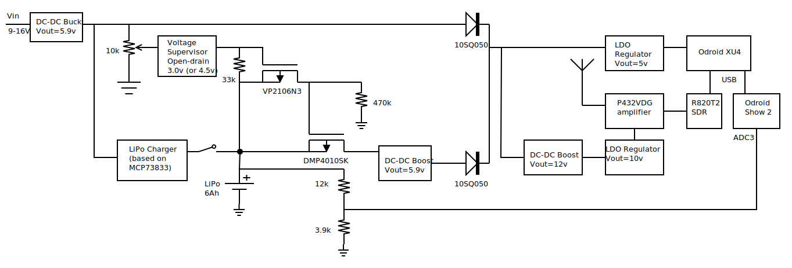
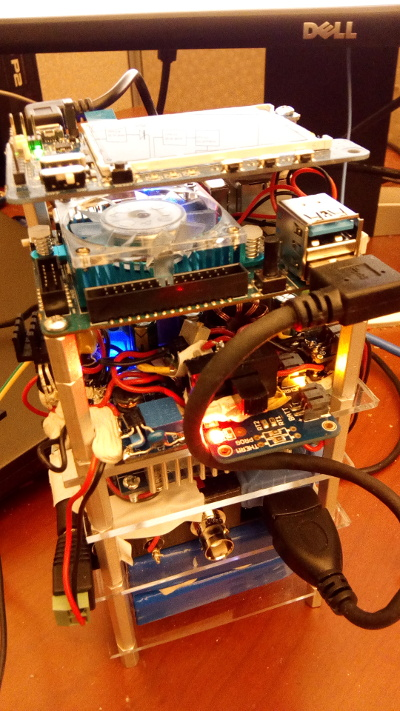
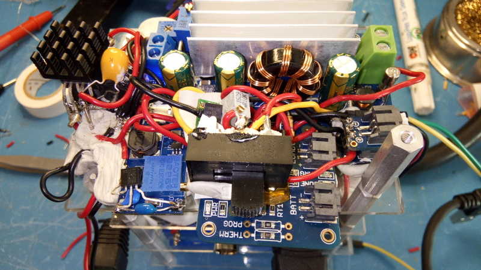

EDBsat: Solar-powered Batteryless KickSat Sprite Satellite
==========================================================

Synopsis
--------

EDBsat (ASPLOS\'18,
[TPC\'17](http://sunsite.informatik.rwth-aachen.de/Publications/AIB/2017/2017-09.pdf))
is a battery-less solar-powered nano-satellite in the
[KickSat](https://www.kickstarter.com/projects/zacinaction/kicksat-your-personal-spacecraft-in-space)
form-factor of a single 35x35mm PCB board. The mission is to evaluate
energy-harvesting technology as a low-cost platform for scientific exploration
of low-earth orbit. Our board has two MCUs: a CC430 for the radio stack and
built-in [EDB](#edb)-based profiler and an MSP430FRxxxx with FRAM non-volatile
memory for the application written in [Chain](#chain). The application samples
temperature, accelerometer, and magnetometer, and sends the data to Earth via
the radio link. The profiler collects a histogram of charge on the capacitor at
the beginning of each task in the application.

The power system uses supercapacitors to accumulate and provide a burst of
energy that is sufficient to transmit a 2-byte packet to Earth, even when there
is zero incoming power from the solar powers during the transmission (e.g., due
to poor orientation). This allows the same board to be used in terrestrial
applications, including in cloudy weather, or near windows indoors.

The firmware for the radio+profiler MCU is in
[edb-sat-prof](https://github.com/CMUAbstract/edb-sat-prof), which includes the
[KickSat SpriteRadio stack](https://github.com/kicksat/arduino_sprite) re-packaged
for [Maker](https://github.com/CMUAbstract/maker). The application MCU runs the
[app-space-data-chain](https://github.com/CMUAbstract/app-space-data-chain)
application. Installation notes for the software are given later in this document.

[Request an EDBsat board from us](http://abstract.ece.cmu.edu) and/or see the
hardware design files (TODO: release). See instructions below on how to build a
ground station with real-time transmisison decoding, an LCD display, and
a battery for portable operation.

Ground station hardware
-----------------------

The ground station for receiving transmissions is built around an SDR dongle
and GNU radio software as described in the [KickSat
wiki](https://github.com/kicksat/groundstation/wiki). Our ground station RF hardware
is the [NooElec R820T2/RTL2838 DVB-T
Stick](http://www.nooelec.com/store/sdr/nesdr-hf-mini-2-plus-bundle.html),
[Advanced Receiver P432VDG](http://www.advancedreceiver.com/page5.html) amplifier,
and [Arrow Antenna 440-5](http://arrowantennas.com/arrowii/440-5ii.html). Our
[fork of the GNU radio decoder
software](https://github.com/CMUAbstract/groundstation) decodes packets in
real-time on an [Odroid XU4 ARM
board with fan](http://www.hardkernel.com/main/products/prdt_info.php?g_code=G143452239825)
(passive heatsink is not enough), which has Cortex 4xA7+4xA15 big.LITTLE, and
displays packets on an [Odroid Show2 LCD
display](http://www.hardkernel.com/main/products/prdt_info.php?g_code=G141743018597).
Our groundstation hardware also includes a battery and power conditioning for
portable operation (TODO: details, upstream).

### Battery-powered base station

The ground station based on Odroid XU4 described above, can be made portable
by adding a battery and some power supply circuitry. The following design
supports concurrently running the load and charging the battery at full
charge current (1A).

#### List of components

Sparkfun/Digikey:

* High current and high capacity LiPo battery: at least two of these in
  parallel [PRT-13856](https://www.sparkfun.com/products/13856) (one is
  insufficient, overcurrent protection trips)

Amazon:

* DC-DC Boost Converter, minimum 4A @ 5V output and minimum 3v input
  [DROK ST45](images/edbsat/drok-st45.jpg)
  [dead (!) link at which the product used to be](http://a.co/7DAG2K3)
  [manufacturer](http://droking.com/)
* DC-DC Boost Converter, 3V -> 10-16V, minimum 0.1A @ 10V [Yeeco 2577](http://a.co/95HBSTz)
* DC-DC Buck Converter, 9-12V -> 5.5-6V, minimum 5A @ 6V, better >6A
  [DROK 8A Buck](http://a.co/8BnJRGi)
  [manufacturer](http://droking.com/)
* 2x Schottky Diode, minimum 5A, [10SQ050 10A](http://a.co/2tssHQo)
* Right-angle Micro-USB cable, 6''/15cm [ReadyPlug](http://a.co/ayUxb28)
* Right-angle USB extension cable, 6''/15cm [Seadream](http://a.co/jltocNL)

Arrow/Digikey:

* Regulator, 5V, minimum 4A,
  [MIC29500-5.0WT](https://www.arrow.com/en/products/mic29500-5.0wt/microchip-technology)
* Regulator, 10-16V, minimum 50mA,
  [TL750L10CLPR](https://www.arrow.com/en/products/tl750l10clpr/texas-instruments)
* LiPo Charger, minimum 1A, [Adafruit LiPo Charger](https://www.adafruit.com/product/259)
  [at Arrow](https://www.arrow.com/en/products/259/adafruit-industries)
* Power P-FET, minimum 4A, as low Rdson as possible (50mOhm is too much, 15mOhm is
  ok) [DMP4010SK3Q](https://www.arrow.com/en/products/dmp4010sk3q-13/diodes-incorporated)
* Voltage supervisor, open drain, active high, ~3.0-5v threshold
  [NCP301HSN45T1G](https://www.arrow.com/en/products/ncp301hsn45t1g/on-semiconductor)
* Small signal P-FET [VP2106N3](https://www.arrow.com/en/products/vp2106n3-g/microchip-technology)
* 1x 100uF ceramic or tantalum cap [TAP107K020HSB](https://www.arrow.com/en/products/tap107k020hsb/avx)
* 2x 47uF ceramic or tantalum cap [FG16X5R1E476MRT00](https://www.arrow.com/en/products/fg16x5r1e476mrt00/tdk)
* 2x JST-PH socket [JST-PH breakout](https://www.adafruit.com/product/1862)
  [at Arrow](https://www.arrow.com/en/products/1862/adafruit-industries)
* 1x 10K POT multi-turn, [64WR10KLF](https://www.arrow.com/en/products/64wr10klf/bi-technologies)
* R=12k and R=3.9k for voltage divider
* SPDT switch, 5A min, [S102031MS02Q](https://www.arrow.com/en/products/s102031ms02q/ck)

**Note**: Use thick wires, at least 22AWG. Solder all joints, unless screw terminal.

**Note**: Set POT on the input to voltage supervisor such that the divided
output is ~0.2v above the supervisor threshold (3.2v for 3.0v supervisor) when
the input supply is plugged in (5.9v).

**Note**: LDO regulators are to protect the Odroid XU4 board and the amplifier,
because the output from the DC-DC convertor may spike (e.g. when load current
suddenly decreases). As an additional precaution, connect incoming power to
Odroid XU4's power jack, not to the header pins, because the latter are not
protected by the XU4's protection IC. I burned one board when DC-DC was
connected directly to 5V pin, most likely due to a spike.

**Note**: The 5V LDO regulator gets hot, so a small heatsink would be good.

Ground station software
-----------------------

On Arch Linux, build and install the following packages, by running for each package:

    git clone URL
    cd repodir/archpkg # except for fftw only do: cd fftw
    makepkg -i

List of packages with links to their parent repositories in order of dependency:

* [`fftw`](https://github.com/CMUAbstract/fftw-PKGBUILD): the library for FFT
  computation that is part of decoding, GNU Radio loads the shared library
  installed in the system by default.
* [`arm-perfcnt-module-dkms`](https://github.com/CMUAbstract/enable_arm_pmu): kernel
  module for allowing access to performance counters on ARM processors, needed by
  the `fftw` library (for timing during the planning phase); the package contains
  systemd config to have the module load on boot
* [`sprite-groundstation`](https://github.com/CMUAbstract/groundstation):
  GNU Radio decoder implementation for the Sprite encoding over the SDR
* [`python-odroidshow`](https://github.com/CMUAbstract/SHOWtime): library for
  writing to the LCD display hooked up to the ODROID XU4 board
* [`edbsat-ground`](https://github.com/CMUAbstract/edb-sat-prof): firmware
  for the radio MCU on the EDBsat, which also contains the python scripts
  for parsing bytes into packets with app data and profile data

***NOTE***: The `edbsat-ground` package references all other packages as
dependencies, so if all these packages where on AUR, then installing it would
be sufficient, but we're not at that point yet, so install each manually, in order.

To flash the forked firmware for the Odroid SHOW LCD screen (with a battery
indicator):
1. Install Arduino IDE (`arduino` Arch package)
2. Clone the [forked repo](https://github.com/CMUAbstract/ODROID-SHOW)
    git clone https://github.com/CMUAbstract/ODROID-SHOW
3. Open `show_main/show_main.ino` in the IDE
4. In Preferences, set Sketchbook location to the repo directory
5. Sketch->Import LIbrary->Add Library, add the repo directory
6. Tools->Serial Port, select tty device that appears when plugging
   in the LCD display via Micro-USB cable to your workstation, e.g.
   `/dev/ttyUSB0`.
7. Upload

The `edbsat-ground` package installs a daemon that listens for transmissions on
SDR, decodes them into bytes and EDBsat-specific packets, and displays both on
the LCD screen. The daemon's configuration is in `/etc/edbsat-ground.conf`,
which specifies the LCD device path and the output files where the decoded
bytes and packets are saved. To start the daemon:

    systemctl start edbsat-ground

Use the `status` command to check if it launched ok and to see any error
output, and `stop` command to terminate it.

If the daemon is running, the LCD display should be showing bytes and packets
from incoming transmissions.

On other distributions, view the build and installation commands in each
PKGBUILD and replicate them manually... or, just install Arch.

### Some explanatory notes

The GNU radio decoder requires [FFTW](http://www.fftw.org) library
([fftw](https://archlinuxarm.org/packages/armv7h/fftw) package on Arch Linux for ARM)
to be rebuilt with ARM NEON SIMD support to make it fast enough for realtime.
On Arch Linux on the XU4 board (or other armv7h boards with Cortex-A\* cores
with NEON support), build from [this forked
PKGBUILD](https://github.com/CMUAbstract/fftw-PKGBUILD) branch
`armv7-a`; on other distros, use the flags and build commands from this
PKGBUILD manually. Before invoking the decoder, enable access to performance
counters for the FFTW library using a kernel module linked from [FFTW
docs](https://github.com/FFTW/fftw3/blob/master/README-perfcnt.md).

When invoking the decoder, set CPU affinity to only the \"big\" A15 cores
(avoiding the \"SMALL\" A7 cores) by prefixing the command with `taskset 0xf0`.
The small cores are too slow for real-time decoding.

The scripts in
[edb-sat-edb/decoder](https://github.com/CMUAbstract/edb-sat-edb/tree/master/decoder)
parse the received bytes, decoded by the GNU radio decoder, into EDBsat packets
and display the bytes and the packets on the LCD display.

